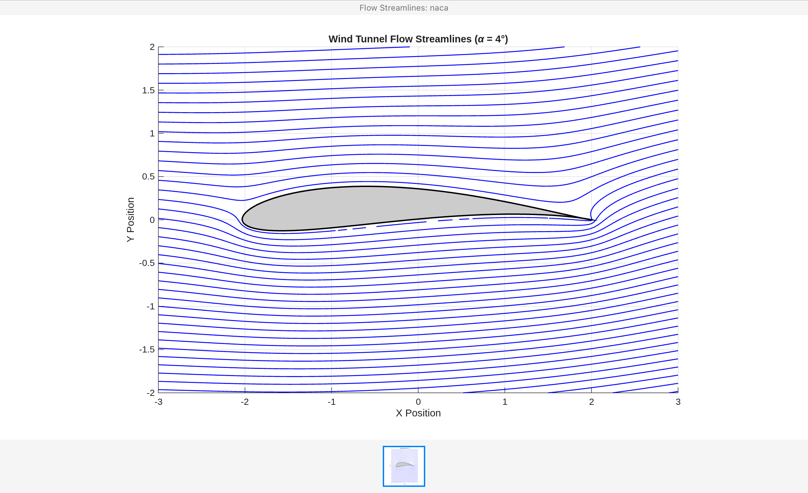

# Aerodynamic Analysis of NACA Airfoils

## Project Overview
This repository analyzes the aerodynamic performance effects of changing camber across three 4-digit airfoils: **NACA 0012** (0% camber), **NACA 2412** (2% camber), and **NACA 6412** (6% camber) at a Reynolds Number of 100,000.

## Aerodynamic Performance Data
The data below summarizes the ultimate outcomes extracted directly from our XFOIL polar files:

| Airfoil Profile | Max Lift (Cl) | Stall Angle | Min Drag (Cd) | Max Efficiency (Cl/Cd) | Pitching Moment (Cm) |
| :--- | :---: | :---: | :---: | :---: | :---: |
| **NACA 0012** (Symmetric) | 1.045 | 12.00° | 0.0135 | ~36.0 | 0.0000 |
| **NACA 2412** (Moderate) | 1.230 | 13.25° | 0.0133 | ~49.3 | -0.0552 |
| **NACA 6412** (High Camber) | 1.503 | 10.75° | 0.0156 | ~58.5 | -0.1325 |

## Data-Driven Conclusions
1. **Camber Boosts Lift:** Moving from 0% to 6% camber increases max lift by over 43% because the curvature forces the air to travel faster over the upper surface.
2. **The Stall Trade-off:** High camber (NACA 6412) causes an early aerodynamic stall at 10.75° due to the aggressive flow separation over the steep upper curve.
3. **Twisting Forces:** High-camber airfoils create severe nose-down twisting forces (Cm = -0.1325). While it produces the highest lift and efficiency, the aircraft structure must be reinforced to handle the torque.

## Phase 3: Joukowski Streamline Simulation
To visualize the physical mechanism of lift, we implemented a 2D Panel Method and Joukowski Transformation directly in MATLAB. This allowed us to mathematically warp a standard cylinder flow field into the exact aerodynamic boundaries of our high-camber wing.

As seen in the simulation below, the streamline velocity packs tightly over the upper surface (creating the low-pressure suction zone), while a clear stagnation point forms at the leading edge.

